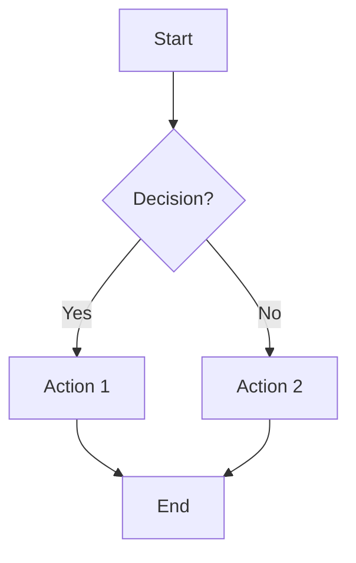
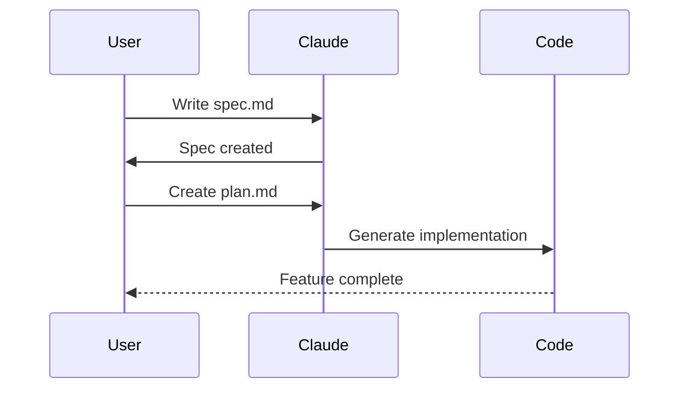
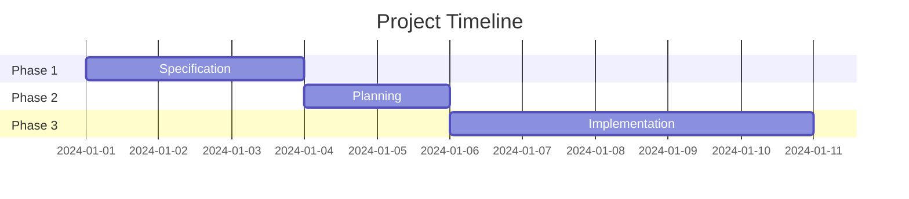
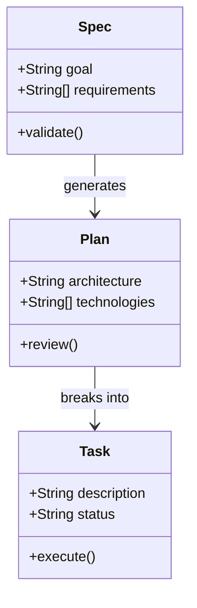
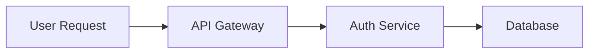

# Diagram & Document Display Guide for Markdown

Best practices for displaying diagrams, Excel, Word documents, and SVG files in Markdown documentation.

---

## Quick Reference Table

| Format | Best Display Method | GitHub Support | Interactivity |
|--------|---------------------|----------------|---------------|
| **Mermaid** | Native code block | Native | Clickable |
| **SVG** | `` tag or `` | Native | Zoomable |
| **PNG/JPG** | `` syntax | Native | Static |
| **Excel (.xlsx)** | Convert to table or link | Link only | None |
| **Word (.docx)** | Convert to MD or link | Link only | None |
| **PDF** | Link with preview | Link only | None |

---

## 1. Mermaid Diagrams (Recommended)

Mermaid is the best option for diagrams in GitHub markdown - it renders natively!

### Flowchart Example



**Markdown code:**
````markdown

````

### Sequence Diagram



### Gantt Chart



### Class Diagram



---

## 2. SVG Images (Best Visual Quality)

SVG files provide the best visual quality and scale perfectly.

### Embedding SVG

**Method 1: Image tag (recommended)**
```html
<p align="center">
  
</p>
```

**Method 2: Markdown syntax**
```markdown

```

**Method 3: Inline SVG (for small icons)**
```html
<svg width="20" height="20" viewBox="0 0 20 20">
  <circle cx="10" cy="10" r="8" fill="#4F46E5"/>
</svg>
```

### SVG Best Practices
- Store in `/docs/diagrams/` folder
- Use descriptive filenames: `feature-flow.svg`, `architecture.svg`
- Include `alt` text for accessibility
- Set explicit `width` for consistency

---

## 3. Excel Files (.xlsx, .xls)

Excel files cannot be rendered directly in markdown. Here are the best alternatives:

### Option A: Convert to Markdown Table

**Original Excel data → Markdown table:**

```markdown
| Feature | Priority | Status | Owner |
|---------|----------|--------|-------|
| Auth    | High     | Done   | Alice |
| API     | Medium   | WIP    | Bob   |
| UI      | Low      | Todo   | Carol |
```

### Option B: Link to Excel File

```markdown
📊 [Download Requirements Spreadsheet](./docs/assets/requirements.xlsx)
```

### Option C: Embed as Image (Screenshot)

```markdown


📥 [Download full spreadsheet](./docs/assets/data.xlsx)
```

### Option D: Use CSV + GitHub Rendering

GitHub renders CSV files as tables. Convert Excel to CSV:

```markdown
📋 [View Data Table](./docs/data/requirements.csv)
```

### Excel Conversion Tools
- **xlsx2md**: `pip install xlsx2md` - Convert Excel to Markdown
- **Online**: tableconvert.com, tablesgenerator.com
- **Excel Export**: Save As → CSV for GitHub rendering

---

## 4. Word Documents (.doc, .docx)

Word documents cannot be rendered in markdown. Best alternatives:

### Option A: Convert to Markdown (Recommended)

Use Pandoc to convert:
```bash
pandoc document.docx -o document.md
```

### Option B: Link with Description

```markdown
## Project Requirements

See the detailed requirements document:

📄 [Requirements Document (Word)](./docs/assets/requirements.docx)

**Summary:**
- Authentication system specs
- API endpoint definitions
- UI wireframe descriptions
```

### Option C: Export as PDF + Link

```markdown
📄 [Requirements (PDF)](./docs/assets/requirements.pdf) |
📝 [Requirements (Word - editable)](./docs/assets/requirements.docx)
```

### Option D: Include Key Content as Markdown

```markdown
## From Requirements Document

### Authentication Requirements
> Users must be able to log in using email/password or OAuth providers...

### API Requirements
> All endpoints must return JSON responses with proper HTTP status codes...

📄 [Full document](./docs/assets/requirements.docx)
```

---

## 5. Directory Structure

Organize your documentation assets:

```
your-project/
├── docs/
│   ├── diagrams/           # SVG, PNG diagram files
│   │   ├── workflow.svg
│   │   ├── architecture.svg
│   │   └── sequence.svg
│   ├── images/             # Screenshots, photos
│   │   ├── ui-mockup.png
│   │   └── excel-preview.png
│   ├── assets/             # Excel, Word, PDF files
│   │   ├── requirements.xlsx
│   │   ├── spec.docx
│   │   └── report.pdf
│   ├── data/               # CSV files (GitHub renders these!)
│   │   └── features.csv
│   └── DIAGRAM-GUIDE.md    # This file
├── README.md
└── SPEC-DRIVEN-APPROACH.md
```

---

## 6. Comparison: When to Use What

### Use Mermaid When:
- Creating flowcharts, sequence diagrams, class diagrams
- You want version-controlled, text-based diagrams
- Diagrams need to be easily editable
- Displaying on GitHub (native support)

### Use SVG When:
- You need precise visual control
- Creating branded or styled graphics
- Diagrams created in design tools (Figma, Illustrator)
- Need scalable, high-quality images

### Use PNG/JPG When:
- Screenshots or photos
- Complex graphics that can't be vectorized
- Quick mockups

### Link Excel/Word When:
- Files need to remain editable by others
- Complex spreadsheets that can't be simplified
- Documents with specific formatting requirements

---

## 7. Tools Recommendations

### Diagram Creation
| Tool | Output | Best For |
|------|--------|----------|
| [Mermaid Live Editor](https://mermaid.live) | Mermaid/SVG | Quick diagrams |
| [Draw.io](https://draw.io) | SVG/PNG | Complex diagrams |
| [Excalidraw](https://excalidraw.com) | SVG/PNG | Hand-drawn style |
| [Lucidchart](https://lucidchart.com) | SVG/PNG | Professional diagrams |

### Conversion Tools
| Tool | From | To |
|------|------|-----|
| Pandoc | Word/PDF | Markdown |
| xlsx2md | Excel | Markdown tables |
| pdf2md | PDF | Markdown |

---

## Example: Complete Documentation Page

```markdown
# Feature Specification

## Overview Diagram



## Architecture

<p align="center">
  
</p>

## Requirements Summary

| ID | Requirement | Priority |
|----|-------------|----------|
| R1 | User auth   | High     |
| R2 | Data export | Medium   |

📊 [Full requirements spreadsheet](./docs/assets/requirements.xlsx)

## Detailed Specification

📄 [Complete specification document](./docs/assets/spec.docx)
```

---

## Summary

1. **Prefer Mermaid** for flowcharts and technical diagrams (version-controlled, GitHub-native)
2. **Use SVG** for high-quality, scalable graphics
3. **Convert Excel → Markdown tables** when possible
4. **Convert Word → Markdown** using Pandoc
5. **Link binary files** with descriptive summaries
6. **Organize assets** in `/docs/` subdirectories
