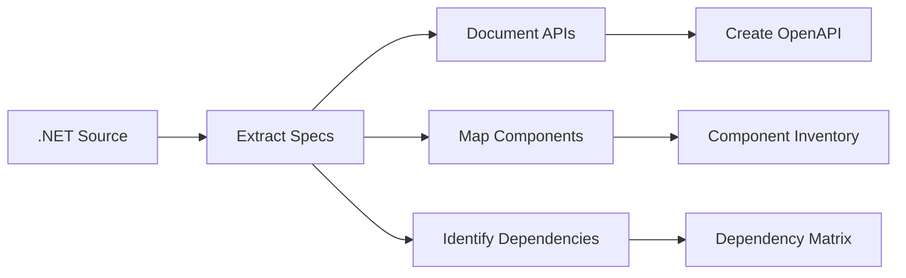
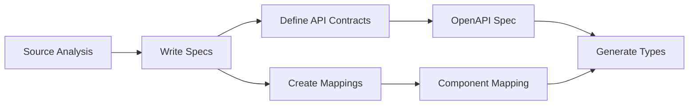
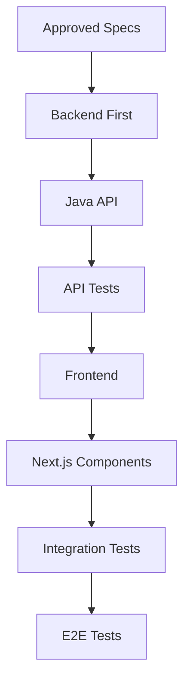

# Spec-Driven Development for .NET to Next.js Migration
# .NET から Next.js への移行のための仕様駆動開発

---

## Table of Contents / 目次

1. [Overview / 概要](#overview--概要)
2. [Architecture Pattern / アーキテクチャパターン](#architecture-pattern--アーキテクチャパターン)
3. [Directory Structure / ディレクトリ構造](#directory-structure--ディレクトリ構造)
4. [IDE Setup / IDE設定](#ide-setup--ide設定)
5. [Spec Templates / 仕様テンプレート](#spec-templates--仕様テンプレート)
6. [Migration Workflow / 移行ワークフロー](#migration-workflow--移行ワークフロー)
7. [Best Practices / ベストプラクティス](#best-practices--ベストプラクティス)
8. [Tools & Extensions / ツールと拡張機能](#tools--extensions--ツールと拡張機能)

---

## Overview / 概要

### English

This guide provides a structured approach to managing **Spec-Driven Development (SDD)** when migrating from **.NET** applications to **Next.js/React** frontend with a **Java** backend. The methodology ensures clear communication between teams, maintains consistency, and enables AI-assisted development with Claude Code.

**Technology Stack:**
- **Source:** .NET (C#, ASP.NET Core, Blazor, etc.)
- **Target Frontend:** Next.js + React + TypeScript
- **Target Backend:** Java (Spring Boot, Jakarta EE)
- **Development Tools:** Visual Studio, Visual Studio Code

### 日本語

このガイドでは、**.NET** アプリケーションから **Next.js/React** フロントエンドと **Java** バックエンドへの移行時に**仕様駆動開発（SDD）**を管理するための構造化されたアプローチを提供します。この方法論により、チーム間の明確なコミュニケーション、一貫性の維持、Claude Codeによる AI 支援開発が可能になります。

**技術スタック:**
- **ソース:** .NET（C#、ASP.NET Core、Blazorなど）
- **ターゲットフロントエンド:** Next.js + React + TypeScript
- **ターゲットバックエンド:** Java（Spring Boot、Jakarta EE）
- **開発ツール:** Visual Studio、Visual Studio Code

---

## Architecture Pattern / アーキテクチャパターン

```
┌─────────────────────────────────────────────────────────────────┐
│                    MIGRATION ARCHITECTURE                        │
│                    移行アーキテクチャ                              │
├─────────────────────────────────────────────────────────────────┤
│                                                                  │
│  ┌──────────────┐     ┌──────────────┐     ┌──────────────┐    │
│  │   .NET       │     │   Next.js    │     │    Java      │    │
│  │   Source     │ ──> │   Frontend   │ <── │   Backend    │    │
│  │   ソース     │     │   フロント    │     │   バックエンド │    │
│  └──────────────┘     └──────────────┘     └──────────────┘    │
│         │                    │                    │             │
│         v                    v                    v             │
│  ┌──────────────────────────────────────────────────────────┐  │
│  │                    .specs/ Repository                     │  │
│  │                    仕様リポジトリ                          │  │
│  │  ┌─────────┐  ┌─────────┐  ┌─────────┐  ┌─────────┐     │  │
│  │  │ dotnet/ │  │ nextjs/ │  │  java/  │  │ shared/ │     │  │
│  │  │ .NET仕様 │  │ Next仕様 │  │ Java仕様│  │ 共通仕様 │     │  │
│  │  └─────────┘  └─────────┘  └─────────┘  └─────────┘     │  │
│  └──────────────────────────────────────────────────────────┘  │
│                                                                  │
└─────────────────────────────────────────────────────────────────┘
```

---

## Directory Structure / ディレクトリ構造

### Recommended Multi-Repository Structure / 推奨マルチリポジトリ構造

```
project-root/
├── .specs/                          # Specification Hub / 仕様ハブ
│   ├── migration/                   # Migration specs / 移行仕様
│   │   ├── 001-auth-migration/
│   │   │   ├── source-analysis.md   # .NET source analysis / .NETソース分析
│   │   │   ├── spec.md              # What & Why / 何を・なぜ
│   │   │   ├── plan.md              # How / どのように
│   │   │   ├── tasks.md             # Step by step / ステップバイステップ
│   │   │   └── mapping.md           # Tech mapping / 技術マッピング
│   │   └── 002-api-migration/
│   │       └── ...
│   │
│   ├── features/                    # New features / 新機能
│   │   └── 001-new-feature/
│   │       ├── spec.md
│   │       ├── plan.md
│   │       └── tasks.md
│   │
│   ├── shared/                      # Shared specs / 共通仕様
│   │   ├── api-contracts/           # API contracts / API契約
│   │   │   ├── openapi.yaml
│   │   │   └── dto-mappings.md
│   │   ├── data-models/             # Data models / データモデル
│   │   │   └── entity-mapping.md
│   │   └── business-rules/          # Business rules / ビジネスルール
│   │       └── rules.md
│   │
│   └── templates/                   # Templates / テンプレート
│       ├── migration-spec.md
│       ├── feature-spec.md
│       └── mapping-template.md
│
├── frontend/                        # Next.js Project / Next.jsプロジェクト
│   ├── .claude/                     # Claude Code config / Claude設定
│   │   ├── commands/
│   │   │   ├── analyze-dotnet.md
│   │   │   ├── generate-component.md
│   │   │   └── sync-api.md
│   │   └── settings.local.json
│   ├── CLAUDE.md
│   ├── src/
│   │   ├── app/                     # Next.js App Router
│   │   ├── components/
│   │   ├── hooks/
│   │   ├── lib/
│   │   └── types/
│   ├── package.json
│   └── tsconfig.json
│
├── backend/                         # Java Project / Javaプロジェクト
│   ├── .claude/
│   │   ├── commands/
│   │   │   ├── analyze-dotnet-api.md
│   │   │   └── generate-endpoint.md
│   │   └── settings.local.json
│   ├── CLAUDE.md
│   ├── src/
│   │   └── main/
│   │       ├── java/
│   │       └── resources/
│   ├── pom.xml                      # Maven
│   └── build.gradle                 # or Gradle
│
├── dotnet-source/                   # Original .NET / 元の.NET
│   ├── .claude/
│   │   └── commands/
│   │       └── extract-spec.md      # Extract specs from code
│   ├── CLAUDE.md
│   └── src/
│       └── ...
│
└── CLAUDE.md                        # Root CLAUDE.md / ルートCLAUDE.md
```

---

## IDE Setup / IDE設定

### Visual Studio Code Setup / VS Code設定

#### Recommended Extensions / 推奨拡張機能

```json
// .vscode/extensions.json
{
  "recommendations": [
    // Essential / 必須
    "ms-dotnettools.csharp",
    "redhat.java",
    "dbaeumer.vscode-eslint",
    "esbenp.prettier-vscode",

    // Spec Management / 仕様管理
    "yzhang.markdown-all-in-one",
    "bierner.markdown-mermaid",
    "davidanson.vscode-markdownlint",

    // Multi-language / マルチ言語
    "ms-dotnettools.csdevkit",
    "vscjava.vscode-java-pack",
    "bradlc.vscode-tailwindcss",

    // AI Assistance / AI支援
    "continue.continue",

    // Productivity / 生産性
    "gruntfuggly.todo-tree",
    "streetsidesoftware.code-spell-checker",
    "eamodio.gitlens"
  ]
}
```

#### Workspace Settings / ワークスペース設定

```json
// .vscode/settings.json
{
  // Spec File Associations / 仕様ファイル関連付け
  "files.associations": {
    "*.spec.md": "markdown",
    "*.plan.md": "markdown",
    "*.tasks.md": "markdown",
    "*.mapping.md": "markdown"
  },

  // Multi-root Workspace / マルチルートワークスペース
  "search.exclude": {
    "**/node_modules": true,
    "**/bin": true,
    "**/obj": true,
    "**/target": true
  },

  // TODO Tree for Specs / 仕様用TODOツリー
  "todo-tree.general.tags": [
    "TODO",
    "FIXME",
    "MIGRATE",
    "SPEC",
    "MAPPING",
    "REVIEW"
  ],

  // File Nesting / ファイルネスト
  "explorer.fileNesting.enabled": true,
  "explorer.fileNesting.patterns": {
    "spec.md": "plan.md, tasks.md, mapping.md, source-analysis.md"
  }
}
```

### Visual Studio Setup / Visual Studio設定

#### Solution Structure / ソリューション構造

```xml
<!-- ProjectMigration.sln -->
Project("{2150E333-8FDC-42A3-9474-1A3956D46DE8}") = "Specs", "Specs", "{GUID}"
    .specs\migration\001-auth-migration\spec.md
    .specs\migration\001-auth-migration\plan.md
    .specs\migration\001-auth-migration\mapping.md
EndProject

Project("{2150E333-8FDC-42A3-9474-1A3956D46DE8}") = "Source-.NET", "Source-.NET", "{GUID}"
    dotnet-source\...
EndProject
```

#### Custom Tool Window / カスタムツールウィンドウ

Create a custom `.editorconfig` for spec files:

```ini
# .editorconfig
[*.{spec,plan,tasks,mapping}.md]
indent_style = space
indent_size = 2
charset = utf-8
trim_trailing_whitespace = true
insert_final_newline = true
```

---

## Spec Templates / 仕様テンプレート

### Migration Spec Template / 移行仕様テンプレート

```markdown
<!-- .specs/templates/migration-spec.md -->

# Migration Spec: [Feature Name]
# 移行仕様: [機能名]

## Metadata / メタデータ
- **ID:** MIG-XXX
- **Source:** .NET [Module/Component]
- **Target Frontend:** Next.js [Component/Page]
- **Target Backend:** Java [Service/Controller]
- **Priority:** High/Medium/Low
- **Status:** Draft/In Review/Approved/In Progress/Complete

---

## 1. Source Analysis / ソース分析

### .NET Components / .NETコンポーネント
```csharp
// Original .NET code reference
// 元の.NETコード参照
Namespace: Example.Auth
Classes: AuthController, AuthService, UserRepository
```

### Dependencies / 依存関係
| .NET Package | Purpose / 目的 | Next.js/Java Equivalent |
|--------------|----------------|------------------------|
| Microsoft.Identity | Auth | NextAuth.js / Spring Security |

---

## 2. Target Architecture / ターゲットアーキテクチャ

### Frontend (Next.js)
```
src/
├── app/
│   └── (auth)/
│       ├── login/
│       └── register/
├── components/
│   └── auth/
└── lib/
    └── auth/
```

### Backend (Java)
```
src/main/java/
└── com/example/
    ├── controller/
    │   └── AuthController.java
    ├── service/
    │   └── AuthService.java
    └── repository/
        └── UserRepository.java
```

---

## 3. API Contract / API契約

### Endpoints
| Method | Path | Request | Response |
|--------|------|---------|----------|
| POST | /api/auth/login | LoginRequest | AuthResponse |

### DTOs
```typescript
// Frontend types / フロントエンド型
interface LoginRequest {
  email: string;
  password: string;
}
```

```java
// Backend DTOs / バックエンドDTO
public record LoginRequest(
    String email,
    String password
) {}
```

---

## 4. Mapping Rules / マッピングルール

### Code Patterns / コードパターン
| .NET Pattern | Next.js Pattern | Java Pattern |
|--------------|-----------------|--------------|
| Controller | API Route / Server Action | @RestController |
| Service | Hook / Server Function | @Service |
| Repository | - | @Repository |
| DTO | TypeScript Interface | Record/Class |

### Data Flow / データフロー
```
.NET MVC → Next.js App Router + Java Spring Boot

[Browser] → [Next.js] → [Java API] → [Database]
              │
              └── Server Components / Actions
```

---

## 5. Acceptance Criteria / 受け入れ条件

- [ ] All .NET functionality replicated / .NET機能の完全な複製
- [ ] API contracts validated / API契約の検証完了
- [ ] Unit tests passing / ユニットテスト合格
- [ ] Integration tests passing / 統合テスト合格
- [ ] Performance benchmarks met / パフォーマンス基準達成

---

## 6. Risks & Mitigations / リスクと対策

| Risk / リスク | Impact | Mitigation / 対策 |
|---------------|--------|-------------------|
| Auth flow differences | High | Early prototype |
```

### Technology Mapping Template / 技術マッピングテンプレート

```markdown
<!-- .specs/templates/mapping-template.md -->

# Technology Mapping: [Module Name]
# 技術マッピング: [モジュール名]

## Framework Mapping / フレームワークマッピング

### Patterns
| .NET Concept | Next.js Equivalent | Java Equivalent | Notes |
|--------------|-------------------|-----------------|-------|
| Razor Pages | React Components | - | |
| Blazor Components | React Components | - | |
| ASP.NET Core MVC | App Router | Spring MVC | |
| Entity Framework | Prisma/Drizzle | JPA/Hibernate | |
| SignalR | Socket.io / Server-Sent Events | WebSocket | |
| ASP.NET Identity | NextAuth.js | Spring Security | |

### Libraries
| .NET Library | npm Package | Maven/Gradle |
|--------------|-------------|--------------|
| Newtonsoft.Json | - | Jackson |
| AutoMapper | - | MapStruct |
| FluentValidation | Zod | Jakarta Validation |
| Serilog | Pino/Winston | Logback/SLF4J |
| xUnit/NUnit | Jest/Vitest | JUnit 5 |

### Architecture Patterns
| .NET Pattern | Next.js/React | Java/Spring |
|--------------|---------------|-------------|
| Dependency Injection | React Context / Props | @Autowired |
| Repository Pattern | Data Access Layer | @Repository |
| CQRS | Server Actions + Queries | Command/Query Handlers |
| Middleware | Next.js Middleware | Filter/Interceptor |
```

---

## Migration Workflow / 移行ワークフロー

### Phase 1: Analysis / 分析フェーズ



#### Claude Code Commands / Claude Codeコマンド

```markdown
<!-- .claude/commands/analyze-dotnet.md -->
Analyze the .NET source code in $ARGUMENTS and:
1. List all controllers, services, and repositories
2. Document all API endpoints with request/response types
3. Identify Entity Framework models
4. Map to proposed Next.js/Java structure
5. Output to .specs/migration/[feature]/source-analysis.md
```

### Phase 2: Specification / 仕様作成フェーズ



### Phase 3: Implementation / 実装フェーズ



---

## Best Practices / ベストプラクティス

### 1. Spec-First Development / 仕様優先開発

**English:**
- Always create specs before coding
- Review specs with both frontend and backend teams
- Use specs as the single source of truth
- Update specs when requirements change

**日本語:**
- コーディング前に必ず仕様を作成する
- フロントエンドとバックエンドの両チームで仕様をレビューする
- 仕様を唯一の真実の情報源として使用する
- 要件変更時は仕様を更新する

### 2. API Contract Validation / API契約の検証

```yaml
# Use OpenAPI for contract-first development
# 契約優先開発にはOpenAPIを使用

openapi: 3.0.3
info:
  title: Migration API
  version: 1.0.0
paths:
  /api/auth/login:
    post:
      operationId: login
      requestBody:
        content:
          application/json:
            schema:
              $ref: '#/components/schemas/LoginRequest'
      responses:
        '200':
          content:
            application/json:
              schema:
                $ref: '#/components/schemas/AuthResponse'
```

### 3. Parallel Development / 並行開発

**English:**
- Backend and frontend can develop in parallel using OpenAPI specs
- Use mock servers for frontend development
- Use contract testing to validate integration

**日本語:**
- OpenAPI仕様を使用してバックエンドとフロントエンドを並行開発
- フロントエンド開発にはモックサーバーを使用
- 統合の検証には契約テストを使用

### 4. Claude Code Integration / Claude Code統合

```markdown
<!-- CLAUDE.md for frontend -->
# Frontend CLAUDE.md

## Project Context
This is a Next.js frontend migrated from .NET Blazor.
Reference specs in: ../.specs/migration/

## Commands
- /analyze-dotnet [path] - Analyze .NET source
- /generate-component [spec-id] - Generate from spec
- /sync-api - Sync with OpenAPI spec

## Patterns
- Use Server Components by default
- Use Server Actions for mutations
- Follow existing component patterns in src/components
```

---

## Tools & Extensions / ツールと拡張機能

### API Development / API開発

| Tool | Purpose / 目的 | Platform |
|------|----------------|----------|
| OpenAPI Generator | Generate types from specs | All |
| Swagger UI | API documentation | All |
| Postman/Insomnia | API testing | All |
| WireMock | Mock server | Java |
| MSW | Mock Service Worker | Next.js |

### Code Generation / コード生成

```bash
# Generate TypeScript types from OpenAPI
# OpenAPIからTypeScript型を生成
npx openapi-typescript specs/openapi.yaml -o src/types/api.ts

# Generate Java DTOs from OpenAPI
# OpenAPIからJava DTOを生成
openapi-generator generate -i specs/openapi.yaml -g spring -o backend/
```

### Spec Management Tools / 仕様管理ツール

| Tool | Purpose | Installation |
|------|---------|--------------|
| GitHub Spec Kit | Spec templates & CLI | `npx github-spec-kit init` |
| Mermaid | Diagrams in Markdown | VS Code extension |
| PlantUML | UML diagrams | VS Code extension |

### VS Code Multi-Root Workspace / VS Codeマルチルートワークスペース

```json
// project.code-workspace
{
  "folders": [
    { "path": ".specs", "name": "📋 Specs" },
    { "path": "frontend", "name": "⚛️ Frontend (Next.js)" },
    { "path": "backend", "name": "☕ Backend (Java)" },
    { "path": "dotnet-source", "name": "🔷 Source (.NET)" }
  ],
  "settings": {
    "editor.formatOnSave": true,
    "files.autoSave": "onFocusChange"
  }
}
```

---

## Quick Reference / クイックリファレンス

### Migration Checklist / 移行チェックリスト

- [ ] Source analysis complete / ソース分析完了
- [ ] Specs created and approved / 仕様作成・承認完了
- [ ] API contracts defined / API契約定義完了
- [ ] Technology mappings documented / 技術マッピング文書化完了
- [ ] Backend implementation complete / バックエンド実装完了
- [ ] Frontend implementation complete / フロントエンド実装完了
- [ ] Integration tests passing / 統合テスト合格
- [ ] Performance validated / パフォーマンス検証完了
- [ ] Security review complete / セキュリティレビュー完了

### Useful Claude Commands / 便利なClaudeコマンド

```bash
# Analyze .NET source / .NETソースを分析
/analyze-dotnet Controllers/AuthController.cs

# Generate from spec / 仕様から生成
/generate-component MIG-001

# Sync API types / API型を同期
/sync-api

# Create migration spec / 移行仕様を作成
/create-migration-spec auth-module
```

---

## References / 参考資料

- [Spec-Driven Development Guide](./SPEC-DRIVEN-APPROACH.md)
- [Next.js Documentation](https://nextjs.org/docs)
- [Spring Boot Documentation](https://spring.io/projects/spring-boot)
- [OpenAPI Specification](https://spec.openapis.org/oas/latest.html)
- [Claude Code Documentation](https://docs.anthropic.com/en/docs/claude-code)

---

*Last Updated: 2025-12-24*
*最終更新: 2025-12-24*
