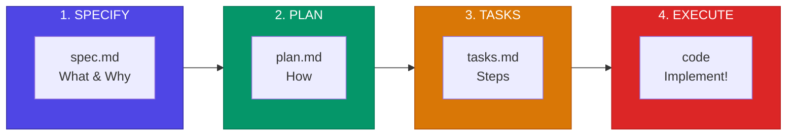

# Spec-Driven Development with Claude Code

**Spec First, Code Second** | **仕様が先、コードは後**

---

## Overview / 概要

This repository provides a practical guide for implementing Spec-Driven Development (SDD) when working with Claude Code. Instead of the traditional "code first, document later" approach, SDD emphasizes creating specifications before writing any code.

このリポジトリは、Claude Codeを使用した仕様駆動開発（SDD）の実践ガイドを提供します。従来の「コードを先に書いて後でドキュメント」ではなく、SDDはコードを書く前に仕様を作成することを重視します。

## The 3-Phase Workflow / 3フェーズのワークフロー

<!-- SVG Diagram (best visual quality) -->
<p align="center">
  
</p>

<!-- Mermaid Diagram (GitHub native, interactive) -->


| Phase | File | Purpose |
|-------|------|---------|
| **Specify** | `spec.md` | Define What & Why |
| **Plan** | `plan.md` | Define How |
| **Tasks** | `tasks.md` | Break into steps |
| **Execute** | code | Implement! |

## Quick Start / クイックスタート

### Option 1: Use GitHub Spec Kit CLI

```bash
# Install
pip install specify-cli
# or
uvx specify

# Initialize
specify init --agent claude

# Use slash commands in Claude Code
/specify   # Create spec
/plan      # Create plan
/tasks     # Create tasks
```

### Option 2: Manual Setup

```bash
mkdir -p .specs/features/001-my-feature
touch .specs/features/001-my-feature/{spec,plan,tasks}.md
```

Then tell Claude Code:
```
"Read the spec.md and create a technical plan"
"Break the plan into implementation tasks"
"Implement task T-1.1"
```

## Documentation / ドキュメント

See [SPEC-DRIVEN-APPROACH.md](./SPEC-DRIVEN-APPROACH.md) for the complete guide including:

### Diagram Display Guide

Need to display Excel, Word, or SVG files in your markdown? See our [Diagram & Document Display Guide](./docs/DIAGRAM-GUIDE.md) for best practices:
- Mermaid diagrams (GitHub native)
- SVG embedding techniques
- Excel → Markdown table conversion
- Word → Markdown conversion with Pandoc

**Complete guide includes:**

- Detailed phase explanations
- Directory structure recommendations
- Best practices
- Tips & tricks for Claude Code
- Extended thinking modes
- Custom slash commands
- Multi-agent workflows
- And more...

## Key Insight / 重要な洞察

> Spec-driven development ensures AI understands your intent before writing code.
>
> 仕様駆動開発により、AIはコードを書く前にあなたの意図を理解します。

## Best Practices / ベストプラクティス

1. **One feature = One spec folder** - 1機能 = 1仕様フォルダ
2. **Review each phase before moving to next** - 次のフェーズに進む前に各フェーズをレビュー
3. **Keep tasks small** (1-2 hours max) - タスクは小さく保つ
4. **Use different models for different phases:**
   - Opus 4 → Spec & Plan (thinking & design)
   - Sonnet 4 → Execution (coding)

## References / 参考資料

- [GitHub Spec Kit](https://github.com/github/spec-kit)
- [Claude Code Best Practices - Anthropic](https://www.anthropic.com/engineering/claude-code-best-practices)
- [Claude Code Documentation](https://code.claude.com/docs/en/)

## License

MIT
