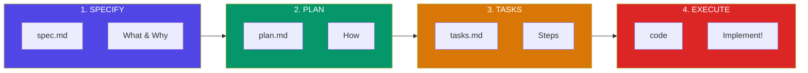

# Spec-Driven Development with Claude Code - Simple Approach Guide
# Claude Codeによる仕様駆動開発 - シンプルなアプローチガイド

---

## English Version

### What is Spec-Driven Development (SDD)?

**Instead of "code first, document later" → "spec first, then code"**

The specification becomes the primary artifact. Code becomes its implementation.

### The 3-Phase Workflow

<!-- Mermaid Diagram (GitHub native rendering) -->


### Phase 1: SPECIFY - Define "What" and "Why"

Create `spec.md`:

```markdown
# Feature: [Feature Name]

## Goal
What problem are we solving?

## User Stories
- As a [user], I want to [action], so that [benefit]

## Requirements
- Functional: What must the system do?
- Non-functional: Performance, security, etc.

## Constraints
- Technical limitations
- Business rules
```

**Claude Code Command:**
```
/spec  or  "Create a spec for [your feature]"
```

### Phase 2: PLAN - Define "How"

Create `plan.md`:

```markdown
# Technical Plan

## Architecture
- Components and their relationships
- Data flow

## Technology Stack
- Languages, frameworks, libraries

## Data Model
- Database schema / data structures

## API Design
- Endpoints, methods, payloads
```

**Claude Code Command:**
```
/plan  or  "Create a technical plan based on spec.md"
```

### Phase 3: TASKS - Break into Small Steps

Create `tasks.md`:

```markdown
# Implementation Tasks

## Task T-1.1: [Task Name]
- Description: What to implement
- Files: Which files to create/modify
- Dependencies: Required previous tasks
- Acceptance: How to verify completion

## Task T-1.2: [Next Task]
...
```

**Claude Code Command:**
```
/tasks  or  "Break the plan into implementation tasks"
```

### Phase 4: EXECUTE - Implement One Task at a Time

```
"Implement Task T-1.1" → Review → "Implement Task T-1.2" → ...
```

### Directory Structure

```
your-project/
├── .specs/                    # or .specify/
│   ├── features/
│   │   └── 001-feature-name/
│   │       ├── spec.md        # What & Why
│   │       ├── plan.md        # How
│   │       └── tasks.md       # Step by step
│   └── templates/
│       ├── spec-template.md
│       ├── plan-template.md
│       └── tasks-template.md
└── src/
    └── ... (your code)
```

### Best Practices

1. **One feature = One spec folder**
2. **Review each phase before moving to next**
3. **Keep tasks small** (1-2 hours max each)
4. **Use different models:**
   - Opus 4 → Spec & Plan (thinking & design)
   - Sonnet 4 → Execution (coding)

---

## 日本語版

### 仕様駆動開発（SDD）とは？

**「コードを先に書いて後でドキュメント」ではなく「仕様を先に、それからコード」**

仕様が主な成果物になります。コードはその実装です。

### 3フェーズのワークフロー

<!-- Mermaidダイアグラム（GitHub対応） -->


### フェーズ1: 仕様定義 - 「何を」「なぜ」を定義

`spec.md`を作成:

```markdown
# 機能: [機能名]

## 目標
どんな問題を解決するか？

## ユーザーストーリー
- [ユーザー]として、[アクション]したい、[メリット]のために

## 要件
- 機能要件: システムは何をすべきか？
- 非機能要件: パフォーマンス、セキュリティなど

## 制約
- 技術的な制限
- ビジネスルール
```

**Claude Codeコマンド:**
```
/spec  または  「[機能]の仕様を作成して」
```

### フェーズ2: 計画 - 「どうやって」を定義

`plan.md`を作成:

```markdown
# 技術計画

## アーキテクチャ
- コンポーネントとその関係
- データフロー

## 技術スタック
- 言語、フレームワーク、ライブラリ

## データモデル
- データベーススキーマ / データ構造

## API設計
- エンドポイント、メソッド、ペイロード
```

**Claude Codeコマンド:**
```
/plan  または  「spec.mdに基づいて技術計画を作成して」
```

### フェーズ3: タスク分解 - 小さなステップに分割

`tasks.md`を作成:

```markdown
# 実装タスク

## タスク T-1.1: [タスク名]
- 説明: 何を実装するか
- ファイル: 作成/変更するファイル
- 依存関係: 必要な先行タスク
- 完了条件: 完了を確認する方法

## タスク T-1.2: [次のタスク]
...
```

**Claude Codeコマンド:**
```
/tasks  または  「計画を実装タスクに分解して」
```

### フェーズ4: 実装 - 1タスクずつ実装

```
「タスクT-1.1を実装して」→ レビュー → 「タスクT-1.2を実装して」→ ...
```

### ディレクトリ構造

```
your-project/
├── .specs/                    # または .specify/
│   ├── features/
│   │   └── 001-feature-name/
│   │       ├── spec.md        # 何を & なぜ
│   │       ├── plan.md        # どうやって
│   │       └── tasks.md       # ステップバイステップ
│   └── templates/
│       ├── spec-template.md
│       ├── plan-template.md
│       └── tasks-template.md
└── src/
    └── ... (コード)
```

### ベストプラクティス

1. **1機能 = 1仕様フォルダ**
2. **次のフェーズに進む前に各フェーズをレビュー**
3. **タスクは小さく保つ**（各タスク1-2時間以内）
4. **モデルを使い分ける:**
   - Opus 4 → 仕様 & 計画（思考 & 設計）
   - Sonnet 4 → 実装（コーディング）

---

## Quick Start / クイックスタート

### Option 1: Use GitHub Spec Kit CLI

```bash
# Install
pip install specify-cli
# or
uvx specify

# Initialize
specify init --agent claude

# Use slash commands
/specify   # Create spec
/plan      # Create plan
/tasks     # Create tasks
```

### Option 2: Manual Setup (Simpler)

```bash
mkdir -p .specs/features/001-my-feature
touch .specs/features/001-my-feature/{spec,plan,tasks}.md
```

Then tell Claude Code:
```
"Read the spec.md and create a technical plan"
"Break the plan into implementation tasks"
"Implement task T-1.1"
```

---

## Summary / まとめ

| Phase | File | Question | フェーズ | ファイル | 質問 |
|-------|------|----------|----------|----------|------|
| 1. Specify | spec.md | What & Why? | 1. 仕様 | spec.md | 何を & なぜ？ |
| 2. Plan | plan.md | How? | 2. 計画 | plan.md | どうやって？ |
| 3. Tasks | tasks.md | Step by step? | 3. タスク | tasks.md | 手順は？ |
| 4. Execute | code | Implement! | 4. 実装 | code | 実装！ |

**Key Insight / 重要な洞察:**
> Spec-driven development ensures AI understands your intent before writing code.
>
> 仕様駆動開発により、AIはコードを書く前にあなたの意図を理解します。

---

---

## Tips & Tricks / ティップス＆トリック

### English Version

#### 1. CLAUDE.md - Your Project's Constitution

The most important file for Claude Code effectiveness is `CLAUDE.md` at your project root:

```markdown
# Project: My App

## Code Style
- Use TypeScript strict mode
- Prefer functional components

## Architecture
- /src/components - React components
- /src/lib - Shared utilities

## Common Commands
- `npm run dev` - Start dev server
- `npm test` - Run tests
```

**Locations:**
- `./CLAUDE.md` - Project memory (checked in)
- `./CLAUDE.local.md` - Local project memory (gitignored)
- `~/.claude/CLAUDE.md` - Global user memory (all projects)

**Pro tip:** Refactor CLAUDE.md often. Keep it concise - it's loaded with every request.

#### 2. Extended Thinking Modes

Trigger deeper reasoning with these magic words:

| Keyword | Token Budget | Use Case |
|---------|-------------|----------|
| `think` | ~4,000 | Simple planning |
| `think hard` | ~8,000 | Moderate complexity |
| `megathink` | ~10,000 | Complex problems |
| `ultrathink` | ~32,000 | Architecture decisions |

**Example:** "Ultrathink about how to refactor this authentication system"

**View thinking:** Press `Ctrl+O` to toggle verbose mode and see Claude's reasoning.

#### 3. Plan Mode

Press `Shift+Tab` twice to enter Plan Mode - Claude outlines an approach before coding.

Use Plan Mode when:
- Starting a new feature
- Debugging complex issues
- Refactoring large codebases

#### 4. Custom Slash Commands

Create reusable prompts in `.claude/commands/`:

```bash
# .claude/commands/fix-issue.md
Fix GitHub issue #$ARGUMENTS

1. Read the issue description
2. Find relevant code
3. Implement the fix
4. Write tests
5. Commit with "fix: closes #$ARGUMENTS"
```

Usage: `/project:fix-issue 123`

#### 5. Hooks - Deterministic Control

Configure in `.claude/settings.json` or use `/hooks` command:

```json
{
  "hooks": {
    "PreToolUse": [{
      "matcher": "Bash(git commit)",
      "command": "echo 'Commit intercepted'"
    }],
    "PostToolUse": [{
      "matcher": "Edit",
      "command": "npx prettier --write $FILE"
    }]
  }
}
```

#### 6. Multi-Agent Parallel Workflows

Leverage subagents for complex tasks:

```
"Explore the codebase using 4 tasks in parallel.
Each agent should explore different directories:
- Agent 1: /src/components
- Agent 2: /src/lib
- Agent 3: /src/api
- Agent 4: /tests"
```

Benefits:
- Each subagent has its own context window
- Results are synthesized by main agent
- Great for large codebases

#### 7. Docker Container Mode

Run Claude Code in isolated containers for automated workflows:

```bash
# Using official Docker sandbox
docker run -it docker/sandbox-templates:claude-code

# Enables --dangerously-skip-permissions safely
claude -p "fix all lint errors" --dangerously-skip-permissions
```

**Use cases:** CI/CD pipelines, batch processing, unattended operations

#### 8. Token Saving Tips

- **`/clear`** - Clear context between tasks (use often!)
- **`/cost`** - Monitor token consumption
- **`/compact`** - Summarize conversation to save context
- **`--resume`** - Continue previous sessions
- **`--continue`** - Resume most recent session

#### 9. Vim Mode

Enable vim-style editing: `/vim` or configure in `/config`

#### 10. Custom Status Line

Customize the bottom status bar to show:
- Current model
- Git branch & uncommitted files
- Token usage progress bar
- Custom project info

#### 11. Using Gemini CLI as Fallback

Claude can't access some sites (Reddit, etc.). Create a skill to use Gemini CLI as fallback:

```markdown
# .claude/skills/web-fallback/SKILL.md
When WebFetch fails, use Gemini CLI:
gemini "fetch and summarize: $URL"
```

---

### 日本語版

#### 1. CLAUDE.md - プロジェクトの憲法

Claude Codeの効果を最大化する最も重要なファイルは、プロジェクトルートの`CLAUDE.md`です：

```markdown
# プロジェクト: マイアプリ

## コードスタイル
- TypeScript strictモードを使用
- 関数コンポーネントを優先

## アーキテクチャ
- /src/components - Reactコンポーネント
- /src/lib - 共有ユーティリティ

## よく使うコマンド
- `npm run dev` - 開発サーバー起動
- `npm test` - テスト実行
```

**配置場所:**
- `./CLAUDE.md` - プロジェクトメモリ（コミット対象）
- `./CLAUDE.local.md` - ローカルメモリ（gitignore対象）
- `~/.claude/CLAUDE.md` - グローバルメモリ（全プロジェクト）

**プロのコツ:** CLAUDE.mdは定期的にリファクタリング。簡潔に保つこと。

#### 2. 拡張思考モード

これらのキーワードでより深い推論を発動：

| キーワード | トークン予算 | 用途 |
|---------|-------------|----------|
| `think` | 約4,000 | 簡単な計画 |
| `think hard` | 約8,000 | 中程度の複雑さ |
| `megathink` | 約10,000 | 複雑な問題 |
| `ultrathink` | 約32,000 | アーキテクチャ決定 |

**例:** 「この認証システムのリファクタリングについてultrathinkして」

**思考を確認:** `Ctrl+O`で詳細モードを切り替え、Claudeの推論を表示。

#### 3. プランモード

`Shift+Tab`を2回押してプランモードに入る - コードを書く前にアプローチを概説。

プランモードを使うとき：
- 新機能の開始時
- 複雑なバグのデバッグ時
- 大規模なリファクタリング時

#### 4. カスタムスラッシュコマンド

`.claude/commands/`に再利用可能なプロンプトを作成：

```bash
# .claude/commands/issue-fix.md
GitHubイシュー #$ARGUMENTS を修正

1. イシューの説明を読む
2. 関連コードを見つける
3. 修正を実装
4. テストを書く
5. "fix: closes #$ARGUMENTS"でコミット
```

使い方: `/project:issue-fix 123`

#### 5. フック - 決定的な制御

`.claude/settings.json`で設定、または`/hooks`コマンドを使用：

```json
{
  "hooks": {
    "PreToolUse": [{
      "matcher": "Bash(git commit)",
      "command": "echo 'コミットをインターセプト'"
    }],
    "PostToolUse": [{
      "matcher": "Edit",
      "command": "npx prettier --write $FILE"
    }]
  }
}
```

#### 6. マルチエージェント並列ワークフロー

複雑なタスクにサブエージェントを活用：

```
"4つのタスクを並列でコードベースを探索して。
各エージェントは異なるディレクトリを担当：
- エージェント1: /src/components
- エージェント2: /src/lib
- エージェント3: /src/api
- エージェント4: /tests"
```

メリット：
- 各サブエージェントは独自のコンテキストウィンドウを持つ
- 結果はメインエージェントが統合
- 大規模コードベースに最適

#### 7. Dockerコンテナモード

自動化ワークフロー用に分離されたコンテナでClaude Codeを実行：

```bash
# 公式Dockerサンドボックスを使用
docker run -it docker/sandbox-templates:claude-code

# --dangerously-skip-permissionsを安全に有効化
claude -p "すべてのlintエラーを修正" --dangerously-skip-permissions
```

**用途:** CI/CDパイプライン、バッチ処理、無人操作

#### 8. トークン節約のコツ

- **`/clear`** - タスク間でコンテキストをクリア（頻繁に使う！）
- **`/cost`** - トークン消費を監視
- **`/compact`** - 会話を要約してコンテキストを節約
- **`--resume`** - 以前のセッションを継続
- **`--continue`** - 最新のセッションを再開

#### 9. Vimモード

Vimスタイルの編集を有効化: `/vim` または `/config`で設定

#### 10. カスタムステータスライン

下部のステータスバーをカスタマイズして表示：
- 現在のモデル
- Gitブランチ & 未コミットファイル
- トークン使用量のプログレスバー
- カスタムプロジェクト情報

#### 11. Gemini CLIをフォールバックとして使用

Claudeは一部のサイト（Redditなど）にアクセスできない。Gemini CLIをフォールバックとして使うスキルを作成：

```markdown
# .claude/skills/web-fallback/SKILL.md
WebFetchが失敗したら、Gemini CLIを使用：
gemini "取得して要約: $URL"
```

---

## References / 参考資料

- [GitHub Spec Kit](https://github.com/github/spec-kit)
- [Spec-Driven Development Guide](https://github.com/github/spec-kit/blob/main/spec-driven.md)
- [GitHub Blog: Spec-driven development with AI](https://github.blog/ai-and-ml/generative-ai/spec-driven-development-with-ai-get-started-with-a-new-open-source-toolkit/)
- [Microsoft Developer Blog](https://developer.microsoft.com/blog/spec-driven-development-spec-kit)
- [Claude Code Tips by ykdojo](https://github.com/ykdojo/claude-code-tips)
- [Claude Code Best Practices - Anthropic](https://www.anthropic.com/engineering/claude-code-best-practices)
- [Claude Code Documentation](https://code.claude.com/docs/en/)
- [Development Containers - Claude Code Docs](https://code.claude.com/docs/en/devcontainer)
